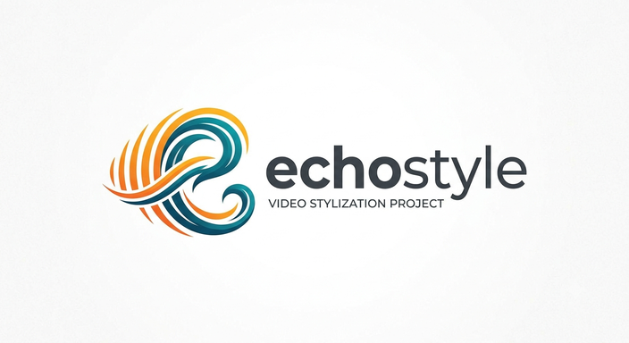

<p align="center">
  
</p>

<h2 align="center">EchoStyle: Unlocking High-Fidelity Video Stylization with Reverse Data Synthesis</h2>

<p align="center">
  <a href="#">📄 Paper</a> &nbsp;|&nbsp;
  <a href="#">🤗 Models</a> &nbsp;|&nbsp;
  <a href="#">🎬 Demo</a>
</p>

<p align="center">
  <em>ECCV 2026</em>
</p>

---

## 📖 Introduction

**EchoStyle** is a high-fidelity video stylization framework built on the [Wan2.2](https://github.com/Wan-Video/Wan2.2) video generation model. It fine-tunes the Wan2.2 14B DiT model using LoRA adapters trained with a novel *reverse data synthesis* pipeline, enabling faithful style transfer across diverse artistic styles — Ghibli, anime, ink wash, oil painting, ukiyo-e, Disney 3D, and more.

### Key Features

- 🎨 **Multi-style video transfer** — supports 6+ artistic styles with a single framework
- 🔄 **Dual-LoRA architecture** — separate LoRA models for high-noise (t=900–1000) and low-noise (t=0–900) timestep ranges, yielding better detail preservation
- ⚡ **Lightning inference** — compatible with [LightX2V](https://github.com/ModelTC/lightx2v) distilled checkpoints for 10-step generation
- 🖥️ **Scalable training** — auto-adapts to multi-node multi-GPU clusters via FSDP + Ulysses sequence parallelism

## 🔧 Environment Setup

### Requirements

- Python ≥ 3.10
- PyTorch ≥ 2.4.0 with CUDA support
- 8× NVIDIA GPUs (80GB VRAM each recommended, e.g. A100/H100)
- Flash Attention 2

### Installation

```bash
# Clone the repository
git clone https://github.com/echostyle2026/Echostyle-code.git
cd Echostyle-code

# Create conda environment
conda create -n echostyle python=3.10 -y
conda activate echostyle

# Install PyTorch (adjust CUDA version as needed)
pip install torch==2.4.0 torchvision==0.19.0 --index-url https://download.pytorch.org/whl/cu121

# Install Flash Attention
pip install flash-attn --no-build-isolation

# Install EchoStyle and all dependencies
pip install -e .
```

## 📦 Model Weights

### 1. Wan2.2 Base Model (Required)

Download the Wan2.2 I2V 14B pretrained weights:

| Model | Source | Link |
|-------|--------|------|
| Wan2.2-T2V-A14B | ModelScope | [Download](https://modelscope.cn/models/Wan-AI/Wan2.2-T2V-A14B) |

```bash
# Place the model weights at:
# ../models/Wan2.2_I2V_14B/
```

### 2. Wan2.2 Lightning Model (Optional, for fast inference)

Download the distilled lightweight checkpoint for accelerated generation (10 steps):

| Model | Source | Link |
|-------|--------|------|
| Wan2.2-Lightning | Hugging Face | [Download](https://huggingface.co/lightx2v/Wan2.2-Lightning) |

```bash
# Place the model weights at:
# ../models/wan2.2_i2v_light/
```

### 3. EchoStyle LoRA Weights

Download the trained EchoStyle dual-LoRA checkpoints from Hugging Face:

| Model | Description | Link |
|-------|-------------|------|
| EchoStyle LoRA (high-noise) | LoRA for timesteps t=900–1000 | [Download](https://huggingface.co/youchun/echostyle) |
| EchoStyle LoRA (low-noise) | LoRA for timesteps t=0–900 | [Download](https://huggingface.co/youchun/echostyle) |

## 🚀 Inference

### Quick Start

1. **Prepare test data** — Edit `scripts/test_10.json` to specify your source videos and style prompts:

```json
[
  {
    "src_video_path": "assets/videos/01.mp4",
    "prompt": "将这段视频转化为'吉卜力'风格。<video description>"
  }
]
```

### Supported Styles

EchoStyle supports 14 artistic styles out of the box (see [`enable_commands.txt`](enable_commands.txt)):

| | | |
|---|---|---|
| 🎨 吉卜力 (Ghibli) | 🌸 日式动漫 (Anime) | 🦸 美式动漫 (Western Cartoon) |
| 🏮 国风动画 (Chinese Animation) | 💧 水彩 (Watercolor) | 🖌️ 水墨 (Ink Wash) |
| 🏰 迪士尼3D动漫 (Disney 3D) | 🧸 皮克斯3D动漫 (Pixar 3D) | ✨ 极简主义 (Minimalism) |
| 🗾 浮世绘 (Ukiyo-e) | 🖼️ 油画 (Oil Painting) | 📺 古早日漫 (Retro Anime) |
| 📖 绘本插画 (Picture Book) | 🌌 新海诚 (Makoto Shinkai) | |

> **💡 Tip:** Using **Chinese prompts** yields the best results, as the model was trained on Chinese-language style descriptions. The recommended prompt format is:
>
> ```
> 将这段视频转化为'<style>'风格。<detailed video description in Chinese>
> ```
>
> For example: `将这段视频转化为'吉卜力'风格。视频展示了一群人聚集在街道上……`

2. **Edit the evaluation script** — Open `scripts/eval.sh` and replace the LoRA path placeholders with your actual checkpoint paths:

```bash
--high_lora_path <your_high_noise_lora_path>
--low_lora_path  <your_low_noise_lora_path>
```

3. **Run inference**:

```bash
bash scripts/eval.sh
```

### Inference Configurations

The evaluation script provides two inference modes:

| Mode | Base Model | Guidance Scale | Steps | Speed | Quality |
|------|-----------|----------------|-------|-------|---------|
| **Standard** | Wan2.2 I2V 14B | 5.0 | 50 (default) | Slower | Higher |
| **Lightning** | Wan2.2 Lightning | 1.0 | 10 | ~5× Faster | Good |

Both modes use 8 GPUs with FSDP and Ulysses sequence parallelism by default. Key parameters you can adjust:

```bash
--nproc_per_node 8          # Number of GPUs
--size 1280*720             # Output resolution
--sample_steps 50           # Denoising steps
--concat True               # Side-by-side comparison output
```

Results will be saved to `results/demo/` (standard) and `results/demo_light/` (lightning).

## 🏋️ Training

### Data Format

Prepare a JSON file with your training data:

```json
[
  {
    "video_path": "path/to/target_style_video.mp4",
    "src_video_path": "path/to/source_video.mp4",
    "prompt": "Style description text"
  }
]
```

### Latent Cache Pre-computation

On the first training run, the framework automatically pre-encodes all videos through VAE and T5 into cached `.safetensors` files at the specified `cache_path`. Subsequent runs load directly from cache, significantly accelerating startup.

### Launch Training

EchoStyle uses a dual-LoRA training scheme — you need to train **two separate LoRA models** for different timestep ranges:

```bash
# Step 1: Train the low-noise LoRA (t=0–900, detail refinement)
bash scripts/train_wan22_i2v.sh wan22_i2v_fused_480p \
  <data.json> <val.json> <output_name> low_noise <cache_path>

# Step 2: Train the high-noise LoRA (t=900–1000, coarse structure)
bash scripts/train_wan22_i2v.sh wan22_i2v_fused_480p \
  <data.json> <val.json> <output_name> high_noise <cache_path>
```

Or use the pre-filled launcher script:

```bash
# Edit scripts/wan2.2_i2v.sh to set your data paths, then:
bash scripts/wan2.2_i2v.sh
```

### Training Arguments

| Argument | Default | Description |
|----------|---------|-------------|
| `$1` config | `wan22_i2v_fused_480p` | Model configuration preset |
| `$2` data_path | — | Path to training data JSON |
| `$3` validation_data | — | Path to validation JSON |
| `$4` output_name | — | Output directory name (under `training_outputs/`) |
| `$5` train_part | — | `low_noise` or `high_noise` |
| `$6` cache_path | — | Directory for VAE/T5 latent caches |

### Multi-Node Multi-GPU Training

The training script **automatically adapts to multi-node multi-GPU clusters** — no manual configuration needed. It reads the standard distributed environment variables set by your cluster scheduler:

| Variable | Description |
|----------|-------------|
| `WORLD_SIZE` | Total number of nodes |
| `MASTER_ADDR` | IP address of the master node |
| `MASTER_PORT` | Communication port (default: 29500) |

Under the hood, the script constructs the appropriate `torchrun` command with `--nnodes`, `--rdzv_backend=c10d`, and FSDP `HYBRID_SHARD` across the device mesh. Simply launch the same script on each node, and training will coordinate automatically.

### Default Training Hyperparameters

| Parameter | Value |
|-----------|-------|
| LoRA rank | 64 |
| LoRA alpha | 32 |
| Learning rate | 2e-5 |
| Batch size | 1 (per device) |
| Max training steps | 50,000 |
| Gradient checkpointing | ✅ Enabled |
| Mixed precision | bf16 |
| Checkpoint interval | Every 2,000 steps |

## 📁 Project Structure

```
Echostyle-code/
├── assets/
│   ├── logo_echostyle.png        # Project logo
│   └── videos/                   # Demo videos (01–11.mp4)
├── scripts/
│   ├── eval.sh                   # Inference script
│   ├── wan2.2_i2v.sh             # Training launcher
│   ├── train_wan22_i2v.sh        # Main training script
│   └── test_10.json              # Sample test data
├── trainer/
│   ├── cli/                      # Entry points (training & evaluation)
│   ├── datasets/                 # Dataset classes with caching
│   ├── models/
│   │   ├── wan21/                # Wan2.1 model implementation
│   │   └── wan22/                # Wan2.2 model implementation
│   │       ├── eval.py           # Evaluation entry point
│   │       └── wan/              # DiT, attention, VAE, T5 modules
│   └── utils/                    # Distributed, checkpoint, logging utilities
├── pyproject.toml
└── README.md
```

## 📝 Citation

```bibtex
@inproceedings{echostyle2026,
  title={EchoStyle: Unlocking High-Fidelity Video Stylization with Reverse Data Synthesis},
  author={Huaqiu Li, Jiahao Wang, Sijia Cai, Hualian Sheng, Bing Deng, Jieping Ye, Wenhan Luo},
  booktitle={European Conference on Computer Vision (ECCV)},
  year={2026}
}
```

## 🙏 Acknowledgements

- [Wan2.2](https://github.com/Wan-Video/Wan2.2) — Base video generation model by Alibaba
- [LightX2V](https://github.com/ModelTC/lightx2v) — Lightning-fast distilled inference
- [PEFT](https://github.com/huggingface/peft) — Parameter-efficient fine-tuning (LoRA)

## 📄 License

This project is released for academic research purposes. Please refer to the [Wan2.2 license](https://github.com/Wan-Video/Wan2.2/blob/main/LICENSE) for base model terms.
